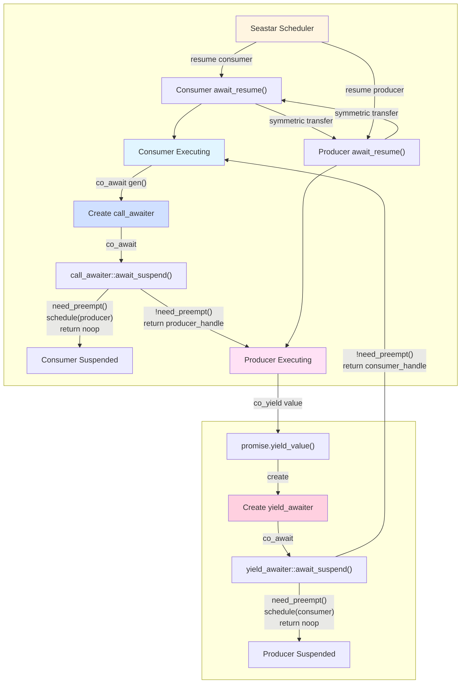
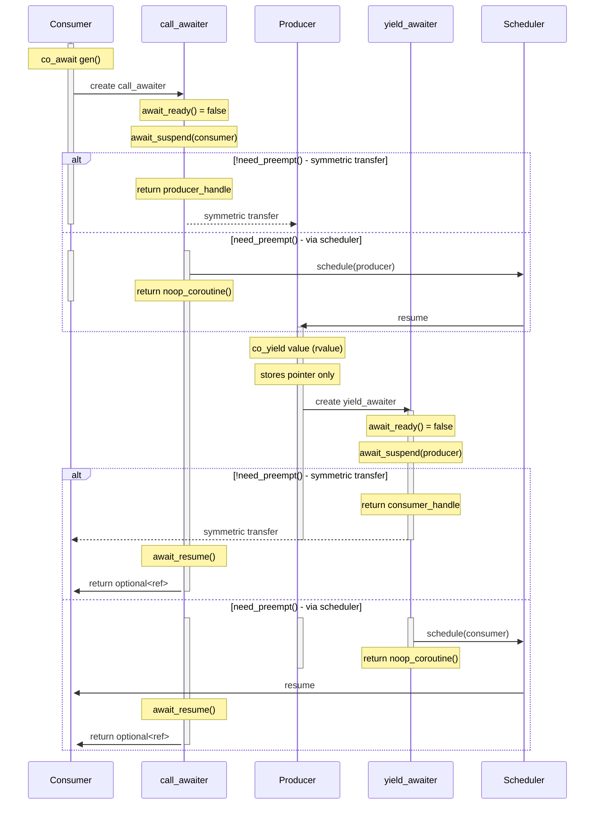
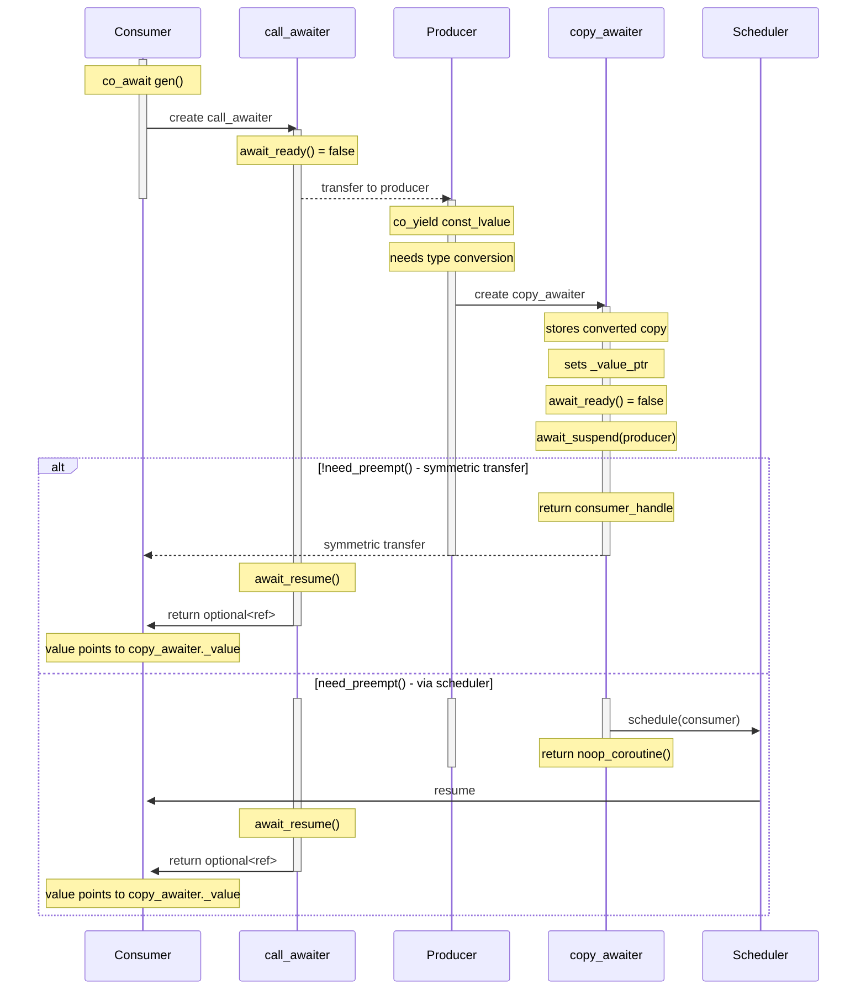
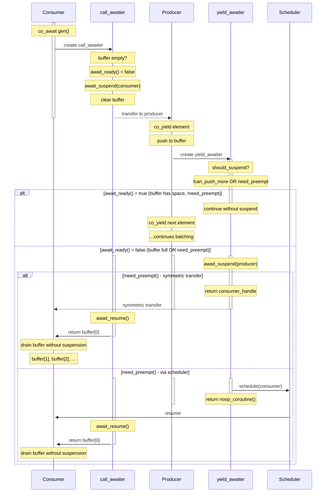

# Coroutine Generator

## Overview

The generator implementation is based on C++23 proposal [P2502R2](https://wg21.link/P2502R2). It provides
asynchronous coroutine-based value generation with two variants:

- **Unbuffered**: Zero-copy, one suspension per element
- **Buffered**: Batches elements, amortizes suspension overhead

Unlike `std::generator`, `operator()` is a coroutine returning
`std::optional<reference_type>`.

## Object Relationships and Control Flow

The generator implementation uses awaiters to manage control flow between producer and consumer coroutines. Each awaiter has multiple entry/exit points:

### yield_awaiter lifecycle (4 entry/exit points):
1. Created by `co_yield value` → `promise.yield_value()` creates awaiter
2. `co_await yield_awaiter` → calls `await_suspend(producer_handle)`
3. `await_suspend()` branches:
   - Direct path: returns `consumer_handle` (symmetric transfer)
   - Scheduler path: schedules consumer, returns `noop_coroutine()`
4. `await_resume()` called:
   - By scheduler (after scheduler path)
   - After symmetric transfer back from consumer

### next_awaiter/call_awaiter lifecycle (4 entry/exit points):
1. Created by `co_await gen()` → `operator()` creates awaiter
2. `co_await call_awaiter` → calls `await_suspend(consumer_handle)`
3. `await_suspend()` branches:
   - Direct path: returns `producer_handle` (symmetric transfer)
   - Scheduler path: schedules producer, returns `noop_coroutine()`
4. `await_resume()` called:
   - By scheduler (after scheduler path)
   - After symmetric transfer back from producer



## Control Flow

Producer and consumer transfer control via symmetric transfer when
`!need_preempt()`. When `need_preempt()` returns true, the target coroutine
is scheduled via `seastar::schedule()` and the current coroutine suspends
to `noop_coroutine()`.

The sequence diagrams below show the complete lifecycle of awaiters as
participants. Awaiters are shown with their creation and destruction
points via activate/deactivate markers. Three separate diagrams cover
the different awaiter types and their behaviors.

### Unbuffered Generator: yield_awaiter (Zero-Copy)

This is the most common case where `co_yield` passes an rvalue reference.
The promise stores only a pointer to the yielded value (zero-copy).



### Unbuffered Generator: copy_awaiter (Type Conversion)

Used when `co_yield` passes a `const` lvalue reference requiring type conversion.
The awaiter creates and stores a copy of the converted value.



### Buffered Generator: yield_awaiter (Batching)

The buffered generator accumulates elements and conditionally suspends.
`await_ready()` can return `true` when the buffer has space and no preemption is needed.



## Unbuffered Generator

### Characteristics

- Stores pointer to value in producer's stack frame
- No copies or moves
- One suspension per yielded element

### Usage

```cpp
generator<const T&> produce() {
    T value;
    co_yield value;  // Zero-copy: stores pointer only
}
```

Use when element moves are expensive or latency is critical.

## Buffered Generator

### Characteristics

- Accumulates elements in a container
- Suspends when buffer full or need_preempt() returns true
- Consumer drains buffer without suspensions

### Usage

```cpp
generator<const T&, T, circular_buffer_fixed_capacity<T, 128>> produce() {
    co_yield element;           // Individual elements
    co_yield std::span(data);   // Ranges
}
```

Use when throughput matters and element moves are cheap.

### Buffer Measurement

The buffered variant uses a customization point object to check buffer capacity:

```cpp
// Priority 1: Member function
struct MemoryBuffer {
    bool can_push_more() const {
        return memory_used < memory_limit;
    }
};

// Priority 2: ADL free function
namespace my_ns {
    bool can_push_more(const MyContainer& c);
}

// Priority 3: Default
return container.size() < container.capacity();
```

## Lifetime Guarantees

### Unbuffered

When `co_yield` evaluates an expression producing a glvalue, the object lives
until the coroutine resumes. The promise stores only a pointer.

### Buffered

Values are moved into the buffer and have independent lifetime.

## Exception Handling

Exceptions in the producer are caught by `promise_type::unhandled_exception()`
and stored. On the next consumer resumption, `await_resume()` rethrows the
exception.

## Template Parameters

### Single-parameter form

```cpp
generator<int>              // value_type=int, reference=int&&
generator<const string&>    // value_type=string, reference=const string&
```

### Two-parameter form

```cpp
generator<string_view, string>  // Return string_view, store string
```

Allows proxy reference pattern: producer yields `string`, consumer receives
`string_view`.

## Performance

Performance characteristics measured using benchmarks in `tests/perf/coroutine_perf.cc`.

### Benchmark Results

Each test generates 100 integers per iteration (Release mode with `-O2`):

| test                                |           runtime |    allocs |      inst |    cycles |
| -                                   |                -: |        -: |        -: |        -: |
| coroutine_test.unbuffered_generator |  308ns ± 0.15%    |     2.000 |   9356.47 |    1639.1 |
| coroutine_test.buffered_generator   |  200ns ± 0.14%    |     2.000 |   6259.26 |    1069.6 |

**Unbuffered generator:**
- One suspension per element (100 suspensions per iteration)
- Zero-copy: stores pointer to value in producer's stack frame
- ~3.1ns per element (308ns / 100)

**Buffered generator** (using `circular_buffer_fixed_capacity<int, 16>`):
- Amortized suspensions (~6-7 suspensions per iteration with buffer size 16)
- Moves elements into fixed-capacity buffer (zero heap allocations)
- **35% faster than unbuffered** due to amortized suspension overhead
- ~2.0ns per element (200ns / 100)

**Important: Container choice is critical for buffered generator performance!**

Using `std::vector` instead of `circular_buffer_fixed_capacity` results in:
- **2.6x slower performance** (524ns vs 200ns)
- **2x more allocations** (4 vs 2) due to dynamic memory
- **2x more instructions** (13,088 vs 6,259)

The heap allocation overhead completely negates the batching benefit. Always use fixed-capacity containers like `circular_buffer_fixed_capacity` for best performance.

### Choosing Between Variants

The choice depends on multiple factors:

**Use unbuffered when:**
- Element moves are expensive (large objects, non-trivial move constructors)
- Latency is critical (need first element ASAP)
- Memory pressure is a concern (no buffering overhead)
- Elements are naturally references to existing data

**Use buffered when:**
- Throughput matters more than latency
- Elements are cheap to move (integers, small PODs)
- Producer can generate elements in batches
- Using a fixed-capacity container (avoids heap allocations)

**Note:** The buffered variant's performance advantage becomes more pronounced with:
- Larger element counts (more amortization)
- Fixed-capacity containers like `circular_buffer_fixed_capacity` (no allocations)
- Higher element generation cost in the producer
- Natural batching in the data source
