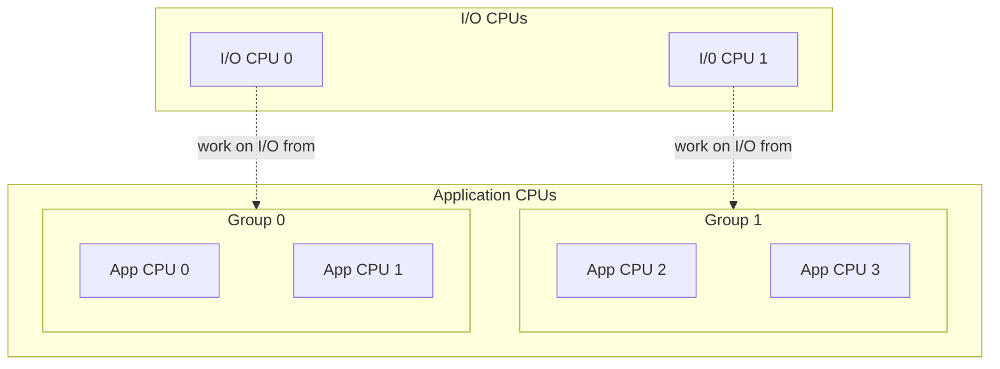

# Asymmetric io_uring Reactor Backend

The `asymmetric_io_uring` reactor backend in Seastar is designed to optimize application performance by offloading all networking and disk I/O processing from compute-bound application shards onto a dedicated set of CPU cores, referred to as **worker cores**.

---

## Overview

In traditional Seastar reactor backends, each shard handles its own I/O processing (such as executing system calls) directly on its assigned application core. While this model is highly efficient for many workloads, it forces shards to split processing time between computations and I/O.

The `asymmetric_io_uring` backend addresses this by dedicating specific CPUs exclusively to running `io_uring` kernel worker threads and Submission Queue (SQ) polling threads. Shards submit I/O requests directly to `io_uring` instances instead of performing synchronous system calls inline, offloading application cores from this responsibility.

This backend is expected to benefit compute-intensive workloads by offloading work from application shards. However, it is unlikely to improve I/O-bound workloads, as multiple shards would delegate their I/O operations to the same worker core, which could become a bottleneck.

---

## Key Concepts

### Speculation-Free Execution (No Fast-Track)
Traditional Seastar backends use a heuristic-based **fast track** for networking I/O. If a socket is speculated to be ready, the backend attempts to execute the operations immediately using synchronous system calls on the application core.

The `asymmetric_io_uring` backend removes the speculative fast path entirely. All networking and disk I/O requests are consistently submitted via `io_uring` and processed off-shard.

### Dedicated Worker Cores
The `io_uring` asynchronous worker threads and polling threads are pinned to a user-defined set of CPUs (`--async-workers-cpuset`). Typically, these cores are aligned with the system's **networking cores** (cores configured to handle network interface card IRQs using the `perftune.py` script) and are excluded from the main Seastar application cpuset.

### Master and Proxy Shards
To avoid excessive thread creation and CPU contention on the worker cores, multiple shards share a single worker core. This is implemented via a **Master/Proxy** grouping model:

* **Grouping**: Shards are partitioned into groups, and each group is [assigned](#worker-to-shard-assignment-algorithm) to a specific worker core.
* **Master Shard**: One shard in each group is designated the master shard. The master shard initializes its `io_uring` instance with the [`IORING_SETUP_SQ_AFF`](https://man7.org/linux/man-pages/man2/io_uring_setup.2.html) flag and sets `sq_thread_cpu` to the assigned worker core, which spawns the SQ polling thread on that core.
* **Proxy Shards**: The remaining shards in the group act as proxy shards. They initialize their `io_uring` instances using the `IORING_SETUP_ATTACH_WQ` flag, passing the master shard's `io_uring` file descriptor. This attaches the proxy instances to the master's instance, allowing them to share the same worker thread pool and SQ polling thread.



### Worker-to-Shard Assignment Algorithm
The assignment of worker cores to application shards is topology-aware:

1. **Topology Detection**: The backend uses the Portable Hardware Locality (`hwloc`) library to detect NUMA nodes, cores, and SMT sibling threads. If `hwloc` is not available, the backend falls back to a topology-agnostic greedy assignment (effectively giving the same result as if there was one NUMA node).
2. **Greedy Allocation**: based on the detected topology, the backend iterates over the application shards in three passes:
   * **Pass 1 (SMT Siblings)**: Assigns worker cores to shards running on application cores that are SMT siblings of those worker cores.
   * **Pass 2 (NUMA Locality)**: Assigns worker cores to shards on application cores in the same NUMA node. The algorithm greedily assigns shards to the least loaded worker core in that NUMA node.
   * **Pass 3 (Cross-NUMA Node)**: For shards that do not have any worker cores in their NUMA node, the algorithm greedily assigns them to the least loaded worker core in other nodes.

---

## Configuration & Usage

### Compilation
The backend must be compiled in by enabling `io_uring` support. Pass the `--enable-io_uring` flag when running the Seastar configuration script:

```bash
./configure.py --enable-io_uring [other options]
```

### Running Seastar
To run an application with the asymmetric backend, specify the reactor backend and the cpuset reserved for the async workers:

```bash
./your_seastar_app --reactor-backend=asymmetric_io_uring --async-workers-cpuset=14-15
```

* `--reactor-backend=asymmetric_io_uring`: Selects the asymmetric backend.
* `--async-workers-cpuset`: Specifies the cores dedicated to the `io_uring` worker and polling threads. **This parameter is mandatory when using this backend.**


### Options Interaction Behavior
The following table summarizes the behavior of Seastar depending on the combinations of CPU configuration options:

| async-workers-cpuset | smp | cpuset | taskset | overprovisioned | Resulting Behavior |
| --- | --- | --- | --- | --- | --- |
| None | Any | Any | Any | Any | **Fail** - Mandatory parameter missing |
| X | None | None | None | True | **Fail** - Overprovisioned without explicit CPU config |
| X | None | None | X | False | **Fail** - All available CPUs assigned to workers, none for shards |
| X | None | Y | N/A | False | **Success** - Shards on Y, workers on X. Warning printed if X ∩ Y ≠ ∅ |
| X ⊆ taskset | n | None | taskset | False | **Success** - n shards on taskset, workers on X, async-workers-cpuset don't affect cpuset for shards |
| X ⊂ taskset | None | None | taskset | False | **Success** - Shards on (taskset - X), workers on X |
| X | n | None | taskset | True | **Success** - n shards created despite contention |
| X | None | Y ⊆ taskset | taskset | True | **Success** - \|Y\| shards created regardless of X |
